# 개인 자산 포트폴리오 관리 봇

[](https://travis-ci.org/IBM/personal-wealth-portfolio-mgt-bot)

*다른 언어로 보기: [English](README.md)、[中国](README-cn.md).*

이번 개발 과정에서는 사용자가 1) Investment Portfolio 서비스를 사용하여 투자 포트폴리오 및 관련 보유 주식을 조회하고 2) Simulated Instrument Analytics 서비스를 사용하여 특정 시나리오에서 주식 분석을 실행하고 3) 웹 인터페이스와 TwilioSMS 같은 인터페이스 상에서 Watson Conversation 기반의 금융 전문 챗봇을 사용할 수 있는 환경을 만들어보겠습니다.

이 과정을 마치면 다음 방법을 이해할 수 있습니다:

* Watson Conversation을 사용하여 챗봇 대화 생성
* Watson Conversation 봇에 웹과 Twilio 등 여러 인터페이스 설정
* Investment Portfolio 서비스로의 접속, 데이터 로딩 및 저장하기
* 시나리오에 따라 데이터를 Simulated Instrument Analytics 서비스로 보내고 분석 확인

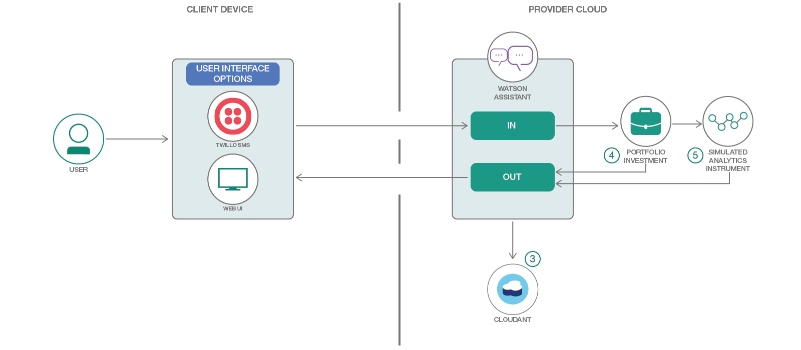

## 포함된 구성요소
- Bluemix Watson Conversation
- Bluemix Cloudant NoSQL DB
- Bluemix Investment Portfolio
- Bluemix Simulated Instrument Analytics
- TwilioSMS

## 단계

``Deploy to Bluemix`` 버튼을 사용하거나 **또는** 서비스를 생성하고 ``Run Locally``를 선택하여 실행합니다.

IBM Cloud for Financial Services를 사용하고 Watson 및 개발자 스타터 킷을 참조하여 미래형 금융 서비스를 빌드힙니다.  https://developer.ibm.com/finance/ 를 방문하십시오.


## Bluemix에 배포

[](https://bluemix.net/devops/setup/deploy?repository=https://github.com/IBM/personal-wealth-portfolio-mgt-bot)

1. 배포 전에 Bluemix 계정에 로그인합니다. 이미 로그인한 상태이면 이 단계를 무시합니다.
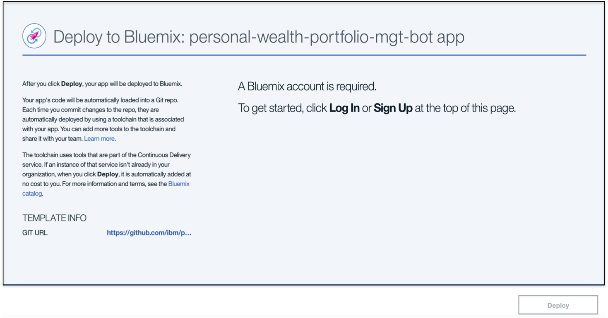

2. 앱을 배포할 준비가 완료된 것을 확인할 수 있습니다. 'Deploy'를 누르기 전에 앱 이름, 지역, 조직, 공간이 올바른지 확인해야 합니다.
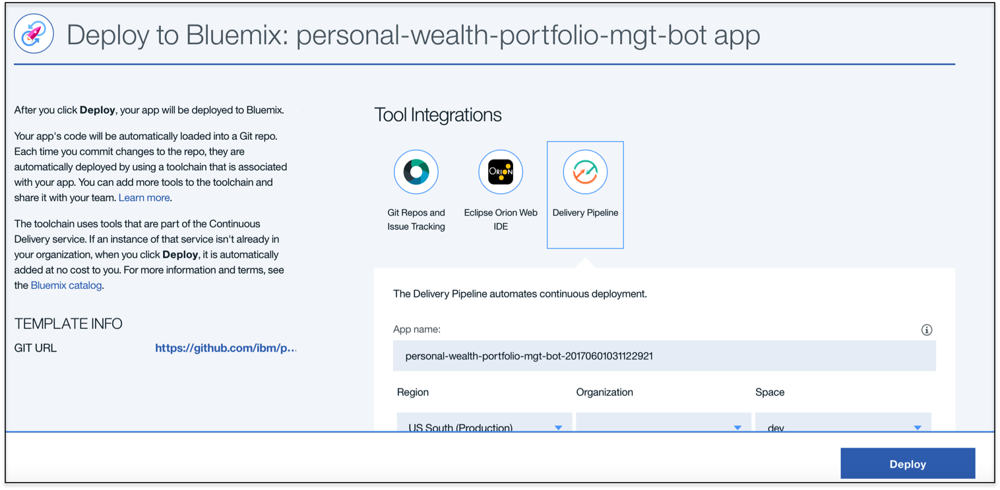

3. 툴체인에 앱이 배포됩니다. eclipseIDE를 통해 코드를 편집하는 옵션도 사용할 수 있으며, 필요에 따라 git이 변경됩니다. 
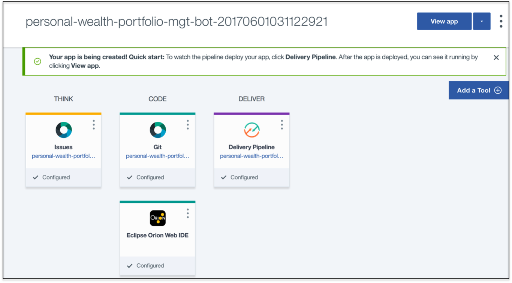

4. **배포 단계**(Deploy Stage)를 완료하면 두 단계를 성공적으로 통과한 것으로 표시됩니다.
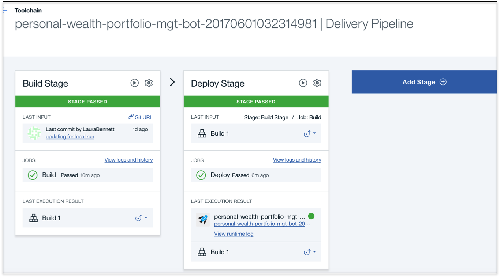

5. 이 과정에서 생성 및 구성되는 앱과 서비스를 확인하려면 Bluemix 대시보드를 사용합니다. 앱의 이름은 personal-wealth-portfolio-mgt-bot 뒤에 특정 문자열이 추가된 형태로 되어 있습니다:

 * [**Watson Conversation**](https://console.ng.bluemix.net/catalog/services/conversation)
 * [**Cloudant NoSQL DB**](https://console.ng.bluemix.net/catalog/services/cloudant-nosql-db/)
 * [**Investment Portfolio**](https://console.ng.bluemix.net/catalog/services/investment-portfolio)
 * [**Simulated Instrument Analytics**](https://console.ng.bluemix.net/catalog/services/simulated-instrument-analytics)

**참고** 해당 애플리케이션을 실행하기 전에 완료해야 하는 몇 가지 단계가 더 있습니다.

구성 프로세스를 시작하기 전에 `personal-wealth-portfoli-mgt-bot` 코드를 로컬에 복제합니다. 터미널 창에서 다음을 실행합니다:

  `$ git clone https://github.com/IBM/personal-wealth-portfolio-mgt-bot.git`

## A. Watson Conversation 구성

이 애플리케이션을 사용하려면 Conversation 서비스가 학습되어 있어야 합니다. 학습 데이터는 [`resources/workspace.json`](resources/workspace.json)파일을 활용합니다.

  1. Bluemix에 로그인한 상태인지 확인합니다.

  2. 왼쪽 상단으로 이동하여 3개의 가로 선을 클릭하고 왼쪽 탐색 패널에서 Dashboard를 선택합니다.

  3. 아래로 스크롤하고 "All Services" 아래에서 사용 중인 Conversation 서비스의 인스턴스를 선택합니다.

  4. 1.	서비스 세부사항 페이지에서 (필요하면) 아래로 스크롤하여 페이지 오른쪽에 있는 녹색의 Launch tool 버튼을 클릭합니다. 이렇게 하면 대화 흐름을 빌드하고 챗봇을 학습할 수 있는 Conversation 서비스 툴이 시작됩니다. 즉, 대화의 흐름을 디자인하고, 학습 시킬 수 있는 Conversation 서비스 작업공간으로 이동하게 됩니다. 하나의 Conversation 서비스 인스턴스 내의 이 작업공간에서 여러 개의 챗봇을 만들 수 있습니다.

  5. 해당 페이지에 새 작업 공간을 “생성”하거나 기존 작업공간을 “가져오는” 옵션이 표시됩니다. 이 예제에서는 미리 만든 챗봇을 “가져올” 예정이므로 “Import" 아이콘 (create 버튼 옆의 화살표 클릭)을 선택합니다.

  <p align="center">
    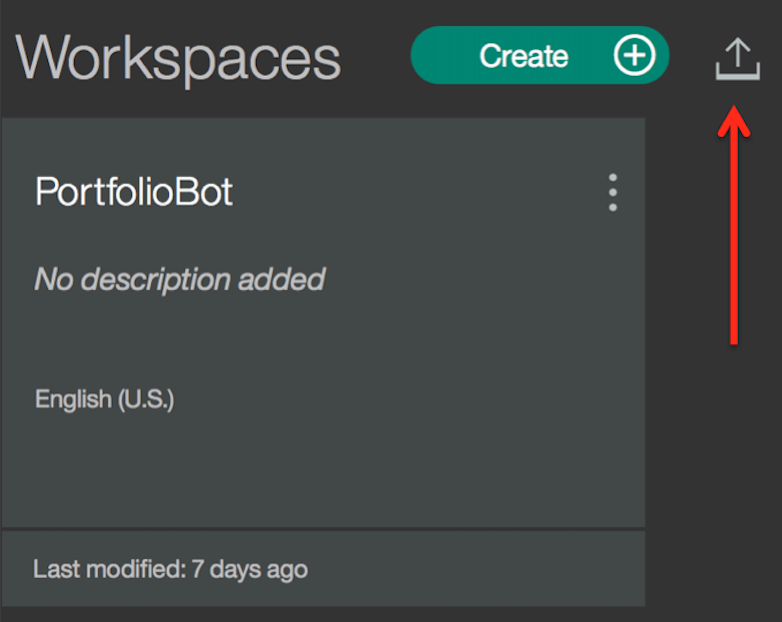
  </p>

  6. Choose a file을 클릭하고, 이 프로젝트에 대한 github 저장소 복제본의 리소스 디렉토리로 이동한 후 workspace.json 파일을 선택합니다. 이 파일을 선택하면 “Everything (Intents, Entities, and Dialog” 옵션이 선택됩니다.

  7. Import를 클릭하여 .json 파일을 업로드하고 작업공간을 생성한 후 Conversation 서비스에 사용되는 모델을 학습시킵니다.

**<span style="color:red">참고:**</span> [C 단계](#c-bluemix에서-환경-변수-구성)에서 사용하기 위해 Workspace ID를 기록해 둡니다.

학습을 마친 후 Workspace ID를 찾아보려면 작업공간 분할창의 오른쪽 상단에 있는 3개의 세로 점을 클릭하고 View details를 선택합니다. 업로드가 완료되면 새 작업공간이 표시됩니다. 이 작업공간을 사용자 애플리케이션에 연결하기 위해서는 애플리케이션 대시보드에 있는 환경 변수에 해당 Workspace ID를 추가시켜야 합니다. ``deploy to Bluemix``버튼을 사용한 경우 해당되고, 로컬에 배치하는 경우에는 “.env” 파일에 저장합니다.) 이 ID를 저장합니다.

*원하는 경우*, 대화 내역을 탐색할 수 있습니다. 작업공간을 선택하고 **Dialog** 탭을 선택합니다. 대화의 일부 모습은 다음과 같습니다:

<p align="center">
  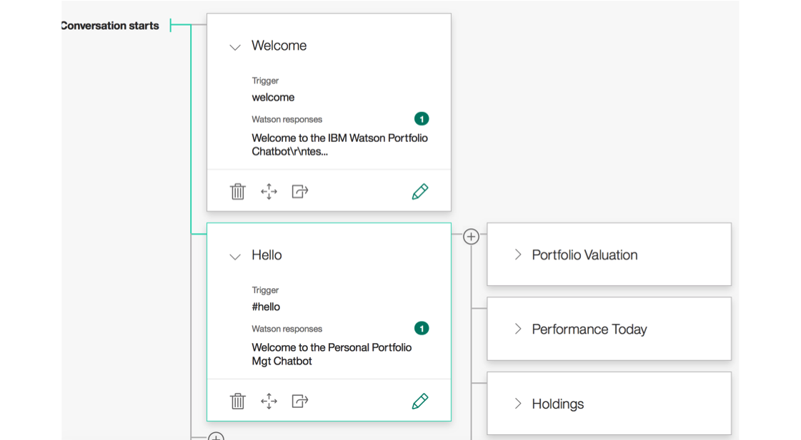
</p>


## B. Investment Portfolio 서비스에 데이터 입력
이제 Investment Portfolio 정보를 수작업으로 입력합니다. 모든 단계에서 **userid, password** 를 BlueMix Service의 신임 정보로 바꾸십시오.

i. Portfolio Investment 서비스에서 포트폴리오 항목을 수동으로 생성하기 예제:

**참고**
* {service-user-id}는 Portfolio Investment 서비스 접근을 위한 사용자 ID입니다.
* {service-user_password} 는 Portfolio Investment 서비스 접근을 위한 비밀번호입니다.

`curl -X POST -u "{service-user-id}":"{service-user_password}" --header 'Content-Type: application/json' --header 'Accept: application/json' -d '{ "name":"P1", "timestamp": "2017-02-24T19:53:56.830Z", "closed": false, "data": { "manager": "Edward Lam" }}' 'https://investment-portfolio.mybluemix.net/api/v1/portfolios'`

ii. 사용자 항목에 보유 주식을 수동으로 생성하기 예제:

`curl -X POST -u "{service-user-id}":"{service-user_password}" --header 'Content-Type: application/json' --header 'Accept:application/json' -d '{ "timestamp": "2017-05-05T19:53:56.830Z", "holdings": [ { "asset": "IBM", "quantity": 1500, "instrumentId": "CX_US4592001014_NYQ"}, { "asset": "GE", "quantity": 5000, "instrumentId": "CX_US3696041033_NYQ" }, { "asset": "F", "quantity": 5000, "instrumentId": "CX_US3453708600_NYQ" }, { "asset": "BAC", "quantity": 1800, "instrumentId": "CX_US0605051046_NYS" } ] }' 'https://investment-portfolio.mybluemix.net/api/v1/portfolios/P1/holdings'`


## C. Bluemix에서 환경 변수 구성
애플리케이션을 실제 실행하기 전에 Bluemix에서 세 개의 환경 변수를 수동으로 업데이트해야 합니다:

애플리케이션의 `runtime` 탭으로 이동합니다. 화면 아래쪽으로 스크롤하고 다음 환경 변수를 추가합니다:

**<span style="color:red">참고:</span>** Workspace ID의 `Value`값을 [A 단계](#a-watson-conversation-구성)에서 기록해 둔 값으로 바꾸십시오.


| Name                                                  | Value                                |
|-------------------------------------------------------|--------------------------------------|
| WORKSPACE_ID                                          | 5b4d1d87-a712-4b24-be39-e7090421b014 |
| USE_WEBUI                                             | true                                 |
| CRED_SIMULATED_INSTRUMENT_ANALYTICS_SCENARIO_FILENAME | ./resources/spdown5_scenario.csv     |

**Save** 를 클릭하여 애플리케이션을 다시 배포합니다.

## D. Bluemix에서 애플리케이션 실행
이제 Bluemix에서 애플리케이션을 실행할 준비가 되었습니다. URL을 선택합니다.
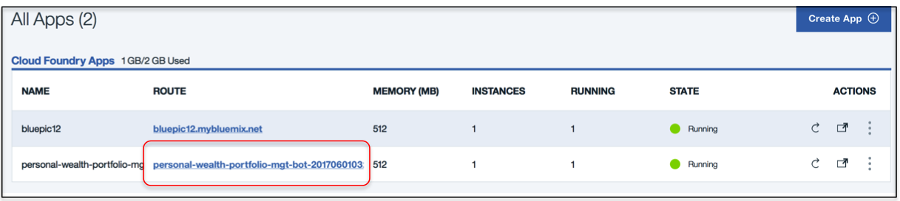

**참고:** 권한 없슴(*not Authorized*) 메시지가 표시되면, 사용한 신임 정보가 Bluemix의 신임 정보와 일치하는지 확인해야 합니다.

# 로컬에서 애플리케이션 실행
> 참고: 이 단계는 ``Deploy to Bluemix`` 버튼을 사용하지 않고 로컬에서 실행하는 경우에만 필요합니다.

1. [저장소 복제](#1-저장소-복제)
2. [Bluemix 서비스 생성](#2-bluemix-서비스-생성)
3. [Watson Conversation 구성](#3-watson-conversation-구성)
4. [Investment Portfolio에 데이터 입력](#4-investment-portfolio에-데이터-입력)
5. [Manifest 파일 구성](#5-manifest-파일-구성)
6. [.env 파일 구성](#6-env-파일-구성)
7. [``controller.js`` 파일 업데이트](#7-파일-업데이트)
8. [애플리케이션 실행](#8-애플리케이션-실행)


## 1. 저장소 복제

`personal-wealth-portfoli-mgt-bot code` 코드를 로컬에 복제합니다. 터미널에서 다음을 실행합니다:

  `$ git clone https://github.com/IBM/personal-wealth-portfolio-mgt-bot.git`

## 2. Bluemix 서비스 생성

다음 서비스를 생성합니다:

* [**Watson Conversation**](https://console.ng.bluemix.net/catalog/services/conversation)
* [**Cloudant NoSQL DB**](https://console.ng.bluemix.net/catalog/services/cloudant-nosql-db/)
* [**Investment Portfolio**](https://console.ng.bluemix.net/catalog/services/investment-portfolio)
* [**Simulated Instrument Analytics**](https://console.ng.bluemix.net/catalog/services/simulated-instrument-analytics)

**참고**
* 이 과정에서는 4개의 Bluemix 서비스를 사용하기 때문에 인스턴스화한 서비스의 수가 한도에 다다를 수 있습니다. 이 문제를 해결하려면 더 이상 필요하지 않은 서비스를 제거합니다. 또한, 생성한 앱의 수가 한도에 다다른 경우에도 더 이상 필요하지 않은 앱을 제거해야 합니다.
* Conversation 서비스의 신임 정보 탭에 나와 있는 사용자 ID, 비밀번호를 기록합니다.

## 3. Watson Conversation 구성
> 참고: ``Deploy to Bluemix`` 부분의 섹션 A를 실행하십시오.

## 4. Investment Portfolio에 데이터 입력
> 참고: ``Deploy to Bluemix`` 부분의 섹션 B를 실행하십시오. 

## 5. Manifest 파일 구성
코드가 있는 폴더에서 `manifest.yml` 파일을 편집하고 `portoflio-chat-newbot`을 사용자의 고유한 애플리케이션 이름으로 바꿉니다. 지정한 이름에 따라 `your-application-name.mybluemix.net`의 형태로 애플리케이션의 URL이 결정됩니다. 또한 Bluemix에 생성한 서비스 이름과 일치하도록 서비스 레이블과 서비스 이름을 업데이트합니다. `manifest.yml` 파일의 관련 부분은 다음과 같습니다:

  ```yml
  declared-services:
  conversation:
      label: Conversation
      plan: free
  Cloudant-service:
      label: cloudantNoSQLDB
      plan: Lite
  investment-portfolio-service:
      label: fss-portfolio-service
  instrument-analytics:
      label: fss-scenario-analytics-service
  applications:
      - services:
      - Conversation
      - Cloudant-service
      - investment-portfolio-service
      - instrument-analytics-service
  name: portfolio-chat-newbot
  command: npm start
  path: .
  memory: 512M
  instances: 1
  domain: mybluemix.net
  disk_quota: 1024M
  ```

## 6. .env 파일 구성

1. 다음 명령을 사용하여 샘플 `.env.example` 파일을 복사하는 방법으로 프로젝트 저장소 복제본의 루트 디렉토리에 `.env`파일을 생성합니다:

**참고** 대부분 파일 시스템은 앞에 "." 이 있는 파일을 숨겨진 파일로 인식합니다. Windows 시스템의 경우 [GitBash](https://git-for-windows.github.io/) 또는 [Xcopy](https://www.microsoft.com/resources/documentation/windows/xp/all/proddocs/en-us/xcopy.mspx?mfr=true) 등을 사용합니다. 


  ```none
  cp .env.example .env
  ```

  [2 단계](#2-bluemix-서비스-생성)에서 여러분이 만드는 서비스마다 Bluemix의 신임 정보로 신임 정보란을 업데이트 합니다.

  The `.env` file will look something like the following:

  ```none

  USE_WEBUI=true

  #CONVERSATION
  CONVERSATION_URL=https://gateway.watsonplatform.net/conversation/api
  CONVERSATION_USERNAME=
  CONVERSATION_PASSWORD=
  WORKSPACE_ID=

  #CLOUDANT
  CLOUDANT_URL=

  #INVESTMENT PORTFOLIO
  CRED_PORTFOLIO_USERID=
  CRED_PORTFOLIO_PWD=
  URL_GET_PORTFOLIO_HOLDINGS=https://investment-portfolio.mybluemix.net/api/v1/portfolios

  CRED_SIMULATED_INSTRUMENT_ANALYTICS_URL=https://fss-analytics.mybluemix.net/api/v1/scenario/instrument
  CRED_SIMULATED_INSTRUMENT_ANALYTICS_ACCESSTOKEN=
  CRED_SIMULATED_INSTRUMENT_ANALYTICS_SCENARIO_FILENAME=

  #TWILIO
  USE_TWILIO=false
  USE_TWILIO_SMS=false
  TWILIO_ACCOUNT_SID=
  TWILIO_AUTH_TOKEN=
  TWILIO_API_KEY=
  TWILIO_API_SECRET=
  TWILIO_IPM_SERVICE_SID=
  TWILIO_NUMBER=
  ```

## 7. 파일 업데이트

추가 단계로, Controller 파일에서 두 개 행을 주석 처리하여 investment portfolio 서비스의 사용자 ID 및 비밀번호를 설정해야 합니다(66-70행).
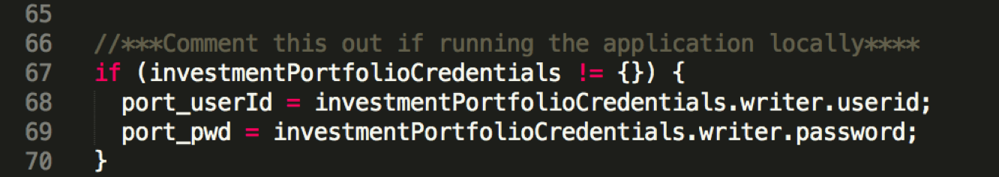

## 8. 애플리케이션 실행

a. 애플리케이션 실행에 필요한 종속 컴포넌트 항목을 설치합니다:

```none
npm install
```

b. 애플리케이션을 로컬에서 시작합니다:

```none
npm start
```

c. [http://localhost:3000/](http://localhost:3000/)로 이동하여 애플리케이션을 테스트합니다.


    Start a conversation with your bot:
<p align="center">
      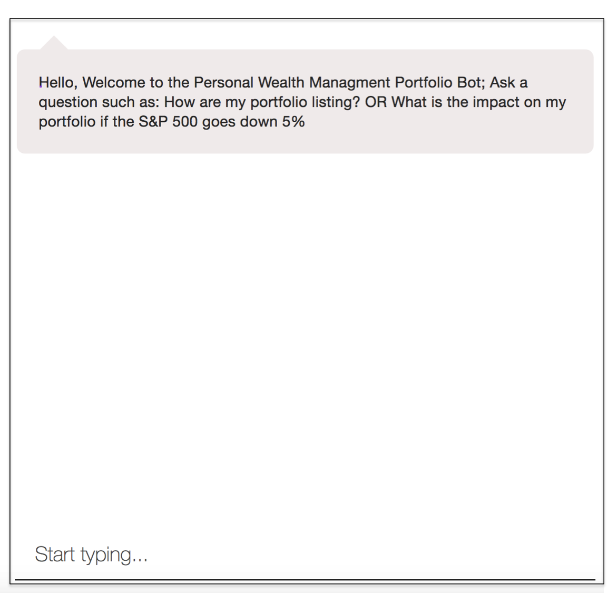
</p>


## Twilio 구성하기 (앱 인터페이스로 Twilio를 사용하길 원하는 경우 진행)

Twilio를 인터페이스로 사용하려는 경우, 단계가 하나 더 남아 있습니다. 몇 가지 환경 변수를 추가로 업데이트해야 합니다. 이 작업은 옵션 단계입니다. 기본적으로 앱의 인터페이스는 WebUI이지만, 이 작업을 거치면 Twilio를 인터페이스로 사용할 수 있습니다.

**참고:** Twilio를 사용하는 것은 옵션으로, 애플리케이션은 기본적으로 Web UI에서 작동합니다. 따라서 Twilio 구성은 Twilio를 사용하는 경우에만 수행하십시오.

1. Twilio 서비스의 전화번호를 확인합니다(아직 하지 않은 경우). https://www.twilio.com/
2. 1.	.env 파일을 편집하여 Twilio에 대한 신임 정보를 추가합니다. 이 정보는 Twilio의 전화 번호를 확인할 때 대시보드에서 알 수 있습니다.


<p align="center">
  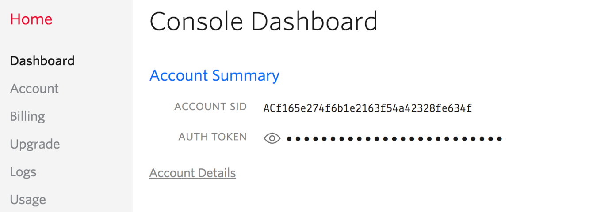
</p>

  * USE_TWILIO_SMS 변수를 *true*로 설정합니다
  * TWILIO_ACCOUNT_SID 변수를 설정합니다
  * TWILIO_AUTH_TOKEN 변수를 설정합니다
  * TWILIO_NUMBER 변수를 설정합니다

"deploy to Bluemix" 버튼을 클릭한 경우, 새로운 값을 저장하고 Bluemix에서 애플리케이션을 다시 실행하여 에러가 있는지 logs를 살펴봅니다.

Twilio가 로컬 포트 (:3000)를 수신 대기하도록 하려면, 터널 및 웹훅(webhook)을 설정해야 합니다. *ngrok* https://ngrok.com/ 툴을 사용하겠습니다. 계속해서 ngrok을 다운로드합니다.  터미널 창을 열고 다음 명령을 사용하여 ngrok를 시작합니다:

```none
ngrok http 3000
```

**참고:** Bluemix에서 애플리케이션을 실행하는 경우 포트 80을 사용하십시오.

다음과 같은 응답이 나타납니다:

<p align="center">
  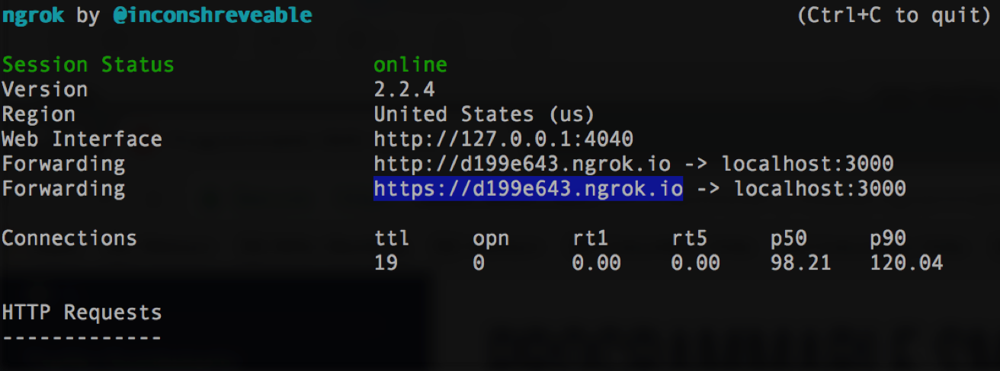
</p>

https uri를 복사하여 (Twilio 대시보드 상의) SMS Webhook에 대한 입력 필드에 붙여 넣습니다:

<p align="center">
  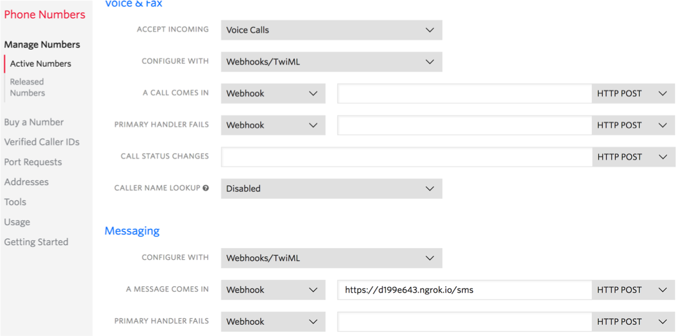
</p>


# 개발 과정의 도입/확장

금융 서비스를 추가하여 현재 애플리케이션을 확장할 수 있습니다. Xignite, Inc.(http://xignite.com)는 Bluemix Fintech 서비스와 매끄럽게 연동되는 클라우드 기반 금융 시장 데이터 API를 제공합니다. 특히, 특정 글로벌 주식의 주가 동향을 시간차를 두고 알 수 있는 GetGlobalDelayedQuotes() Rest API가 지원됩니다.

<p align="center">
  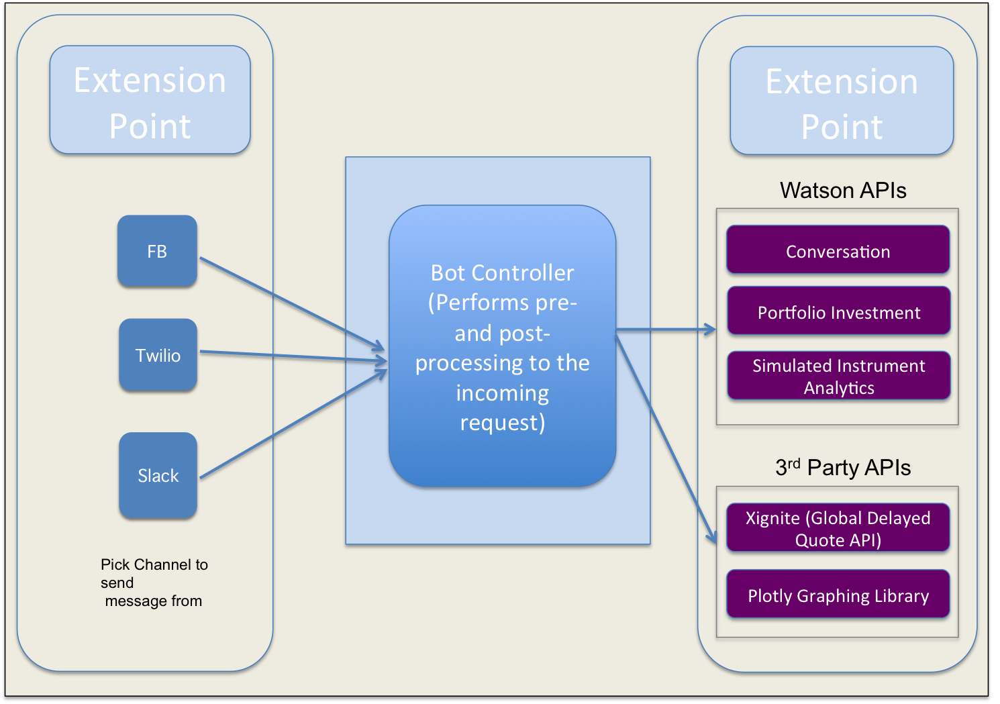
</p>

# 문제점 해결

* Bluemix 애플리케이션의 문제점을 해결하려면 로그를 사용합니다. 로그를 보려면 다음을 실행하십시오:

    ```bash
    cf logs <application-name> --recent
    ```

* 로컬에서 실행하는 경우, 환경 변수가 일치하는지 자세히 확인합니다. Bluemix 서비스 (Conversation, Cloudant, and Discovery)의 신임 정보는 Bluemix의 ``Services`` 메뉴에서 ``Service Credentials`` 옵션을 선택하면 확인할 수 있습니다.

* 또한, 애플리케이션을 디버깅하려면 `https://<사용자 애플리케이션 이름>.mybluemix.net/debug.html`로 이동하여 사용하는 서비스와의 상호작용 세부사항이 담긴 메타데이터가 표시된 패널을 확인합니다.

# 라이센스

[Apache 2.0](LICENSE)
