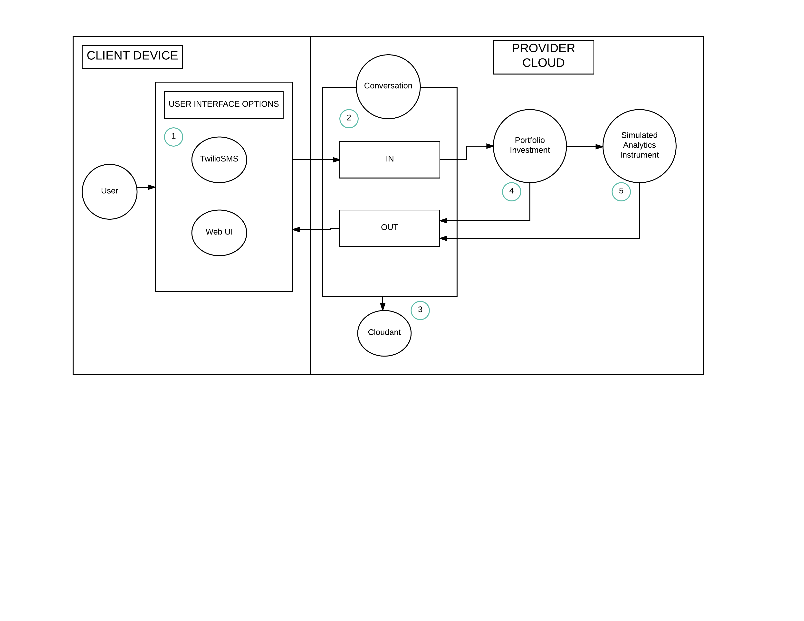
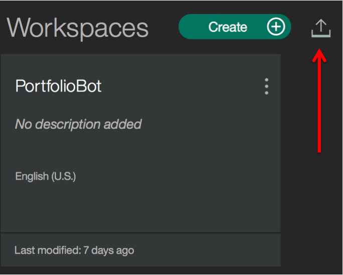
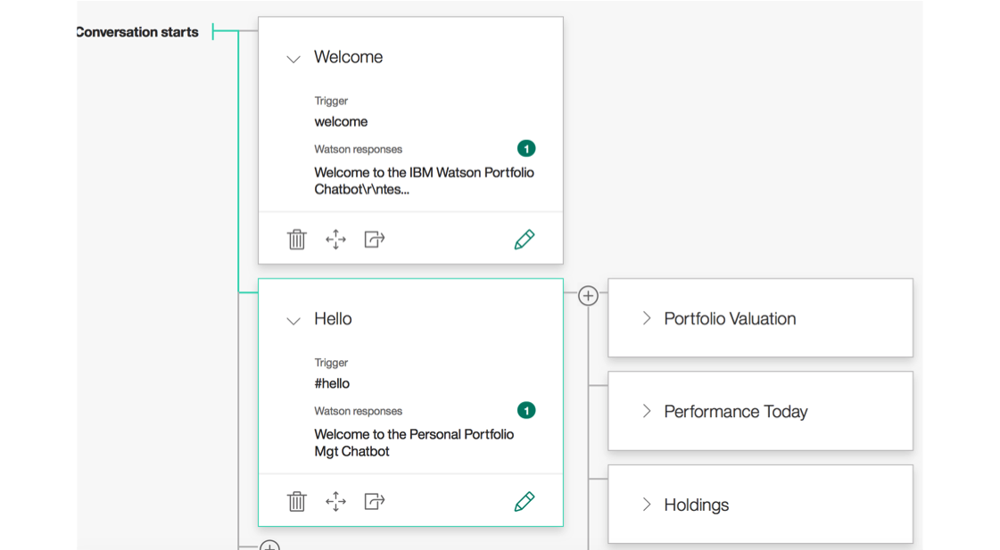
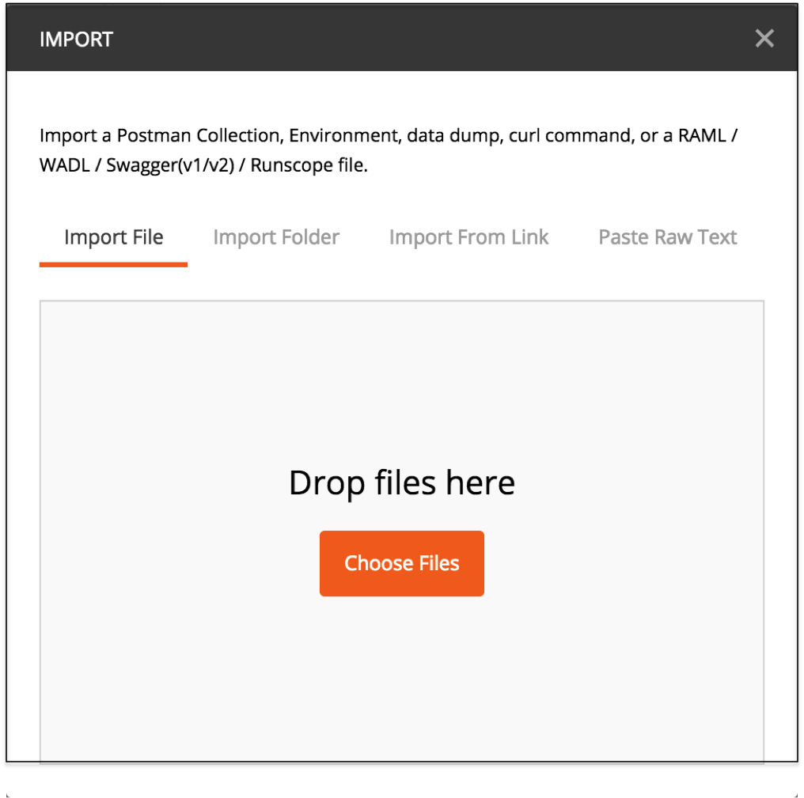
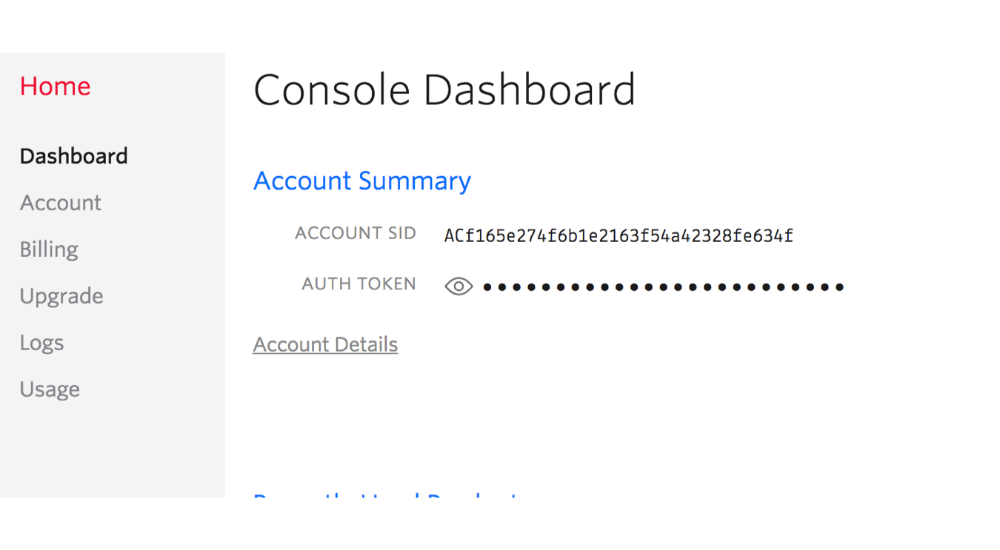
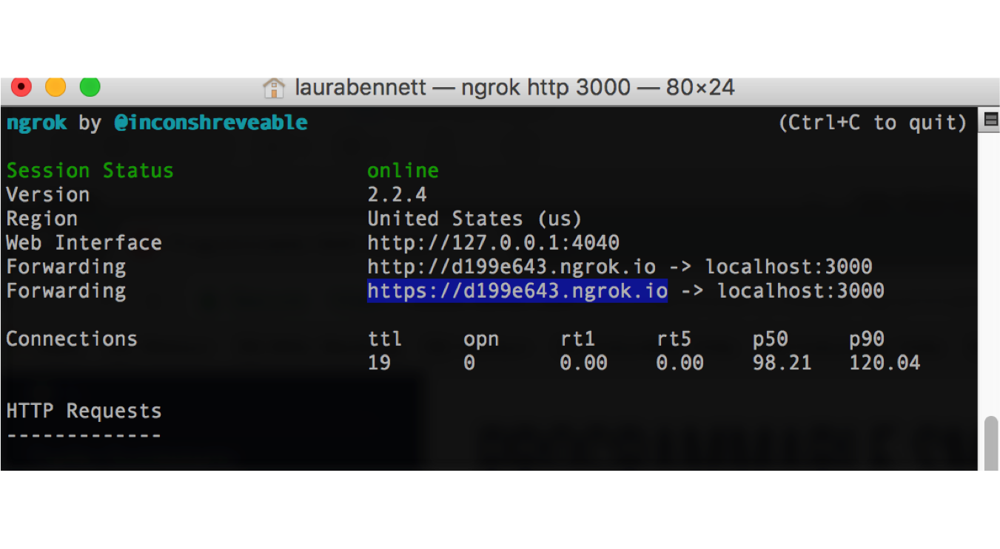
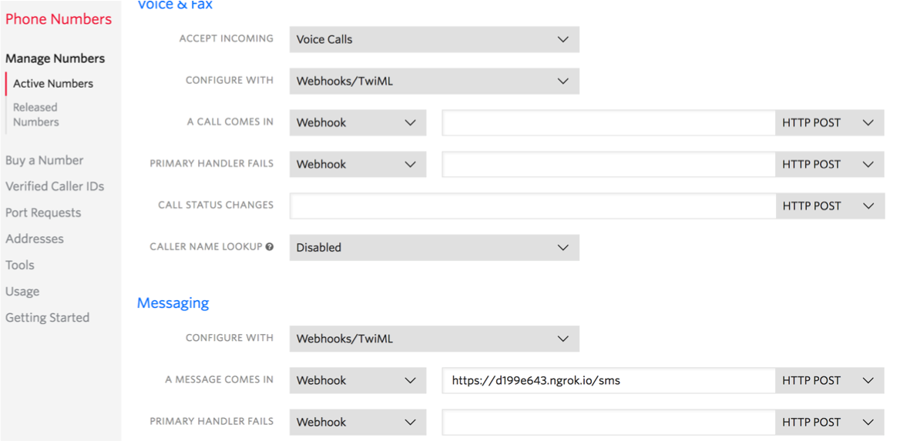
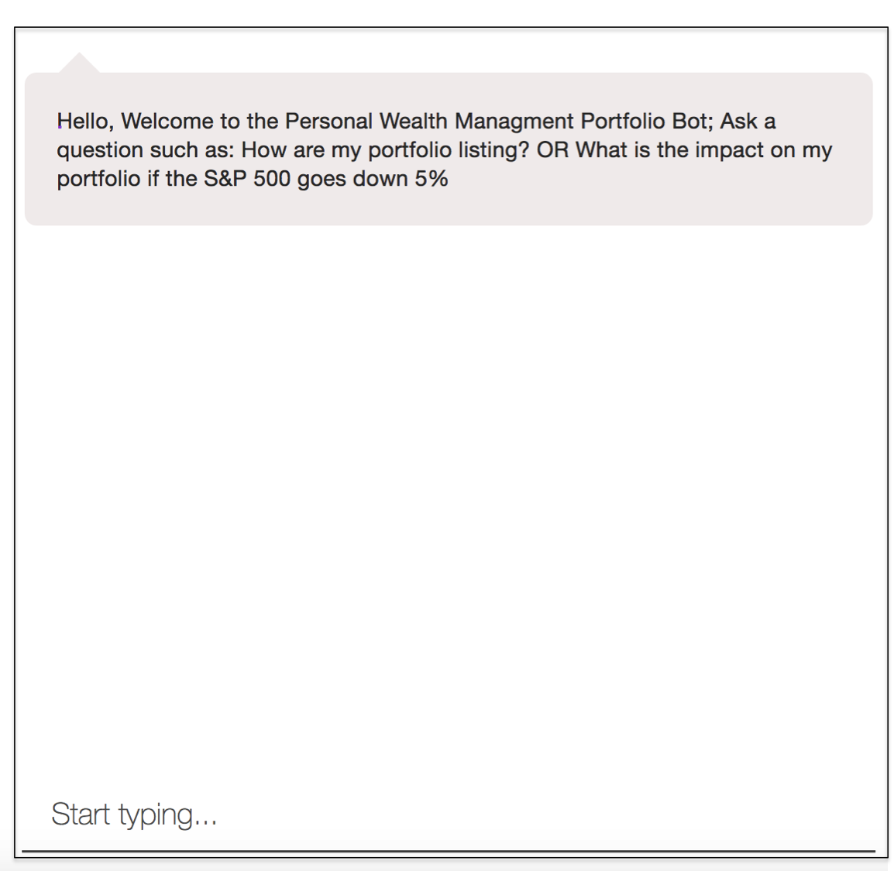
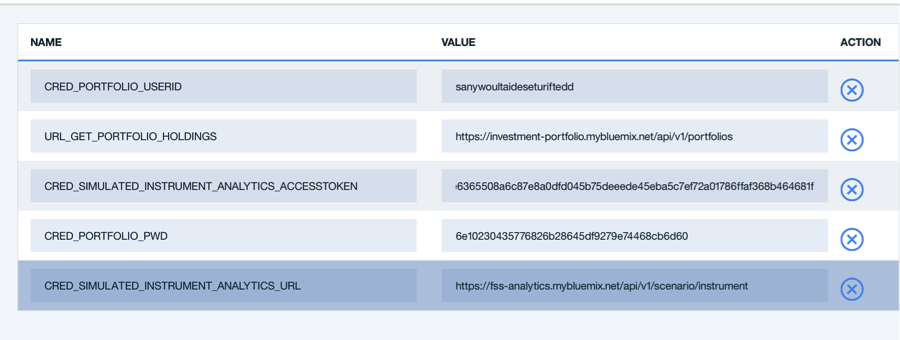
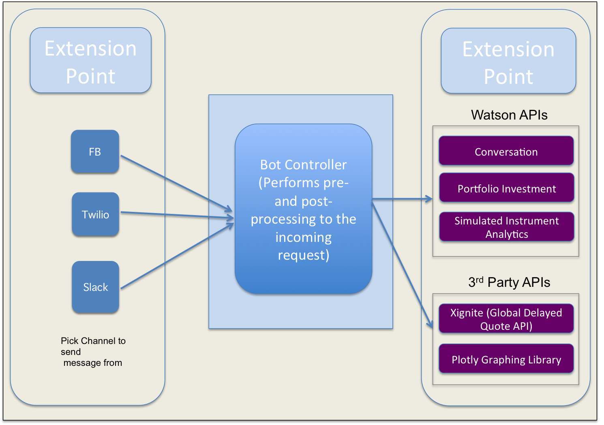

# Personal Wealth Portfolio Management Bot

[](https://travis-ci.org/IBM/personal-wealth-portfolio-mgt-bot)

In this developer journey we will create a financial-based Watson Conversation based chatbot
that allows a user to: 1) use an Investment Portfolio service to query his or her investment portfolios and associated holdings 2) use the Simulated Instrument Analytics service to compute analytics on securities under a given scenario. 3) understand how to swap between alternative interfaces:  a) web interface b) TwilioSMS

When the reader has completed this journey, he or she will understand how to:

* Create a chatbot dialog with Watson Conversation
* Set up multiple interfaces with the Watson Conversation bot: Web & Twilio
* Access, seed and send data to the Investment Portfolio Service
* Send data along with a scenario to the Simulated Instrument Analytics service to retrieve analytics

<p align="center">
  
</p>

## Included Components
- Bluemix Watson Conversation
- Bluemix Cloudant NoSQL DB
- Bluemix Investment Portfolio
- Bluemix Simulated Instrument Analytics
- TwilioSMS
- Node

## Steps

**NOTE:** Perform steps 1-8 **OR** click the ``Deploy to Bluemix`` button and hit ``Create`` and then jump to step 7.

Use the IBM Cloud for Financial Services to build the future of financial services with to help from Watson and developer starter kits.  Visit https://developer.ibm.com/finance/

[](https://bluemix.net/deploy?repository=https://github.com/ibm/personal-wealth-portfolio-mgt-bot)

1. [Clone the repo](#1-clone-the-repo)
2. [Create Bluemix services](#2-create-bluemix-services)
3. [Configure Watson Conversation](#3-configure-watson-conversation)
4. [Configure and Seed the Investment Portfolio](#4-configure-investment-portfolio)
5. [Configure Manifest.yml file](#5-configure-manifest)
6. [Configure .env file](#6-configure-dotenv)
7. [Configure Twilio](#7-configure-twilio)
8. [Run the application](#8-run-the-application)


## 1. Clone the repo

Clone the `personal-wealth-portfoli-mgt-bot code` locally. In a terminal, run:

  `$ git clone https://github.com/IBM/personal-wealth-portfolio-mgt-bot.git`

* We’ll be using the file [`resources/workspace.json`] with the Conversation Service.
* If you don't want to seed your Investment Portfolio service manually, you can use run the file [`resources/Portfolio API's (PROD).postman_collection`] through the tool: [Postman App](https://www.getpostman.com/).
* We'll use the file [`resources/conditional_out.csv`] with the Simulated Instrument Analytics Service.

## 2. Create Bluemix services

Create the following services:

* [**Watson Conversation**](https://console.ng.bluemix.net/catalog/services/conversation)
* [**Cloudant NoSQL DB**](https://console.ng.bluemix.net/catalog/services/cloudant-nosql-db/)
* [**Investment Portfolio**](https://console.ng.bluemix.net/catalog/services/investment-portfolio)
* [**Simulated Instrument Analytics**](https://console.ng.bluemix.net/catalog/services/simulated-instrument-analytics)

**Note**
* Because this Journey uses 4 Bluemix services, you may hit your limit for the number of services you have instantiated. You can get around this by removing services you don't need anymore. Additionally - if you hit the limit on the number of Apps you have created, you may need to also remove any that you don't need anymore.
* Record the userid, password from the credentials tab on the Conversation Service.

## 3. Configure Watson Conversation


The Conversation service must be trained before you can successfully use this application.  The training data is provided in the file: [`resources/workspace.json`](resources/workspace.json)

  1. Login to Bluemix

  2. Navigate to upper left hand side and click on the 3 parallel lines and select Dashboard from the left hand navigation panel.

  3. Scroll down and under "All Services" - select the instance of the Conversation service that you are using

  4. Once on the Service details page, scroll down (if necessary) and click green Launch tool button on the right hand side of the page. This will launch the tooling for the Conversation service, which allows you to build dialog flows and train your chatbot. This should take you to your workspace in the Conversation service which represents a unique set of chat flows and training examples. This allows you to have multiple chatbots within a single instance of the Conversation service.

  5. Once on the page, you will see the option to either “Create” a new workspace, or “import” an existing one. We are going to “import” a premade chatbot for this example, so select “Import" (click on the arrow next to the create button).

  <p align="center">
    
  </p>

  6. Click Choose a file, navigate to the resources directory of your clone of the repository for this project, and select the file workspace.json. Once the file is selected, ensure that the “Everything (Intents, Entities, and Dialog” option is selected.

  7. Click Import to upload the .json file to create a workspace and train the model used by the Conversation service.

To find your workspace ID once training has completed, click the three vertical dots in the upper right-hand corner of the Workspace pane, and select View details. Once the upload is complete, you will see a new workspace.  In order to connect this workspace to our application, we will need to include the Workspace ID in our environment variables file “.env”. Save this id to enter in your .env file later in the instructions.


*Optionally*, you may want to explore the conversation dialog. select the workspace and choose the **Dialog** tab, here's a snippet of the dialog:

<p align="center">
  
</p>

## 4. Configure and Seed the Investment Portfolio  Service

Using the free Postman Tool (https://www.getpostman.com/):

i. Start Postman

ii. Select *Import* [`resources/Portfolio API's (PROD).postman_collection`]

<p align="center">
  
</p>

iii. Select *Runner*

iv. Select the [`resources/Portfolio API's (PROD).postman_collection`] from the dropdown

v. Select Start Run

This will create add holdings and their instruments to your Investment Portfolio

Alternatively, you can manually seed your Investment Portfolio. For all these steps - replace userid, password and service url with the credentials from your BlueMix Service.

**NOTE:** If you get a *not Authorized* message - you need to confirm that the credentials you used match the credentials in Bluemix.

i. Example of manually creating a portfolio entry in your Portfolio Investment Service:

**NOTE**
* service-user-id is the user id associated with your Portfolio Investment Service
* service-user_password is the password associated with your Portfolio Investment Service

`curl -X POST -u "{service-user-id}":"{service-user_password}" --header 'Content-Type: application/json' --header 'Accept: application/json' -d '{ "name":"P1", "timestamp": "2017-02-24T19:53:56.830Z", "closed": false, "data": { "manager": "Edward Lam" }}' 'https://investment-portfolio.mybluemix.net/api/v1/portfolios'`

ii. Example of manually creating holdings in your entry:

`curl -X POST -u "{service-user-id}":"{service-user_password}" --header 'Content-Type: application/json' --header 'Accept:application/json' -d '{ "timestamp": "2017-05-05T19:53:56.830Z", "holdings": [ { "asset": "IBM", "quantity": 1500, "instrumentId": "CX_US4592001014_NYQ"}, { "asset": "GE", "quantity": 5000, "instrumentId": "CX_US3696041033_NYQ" }, { "asset": "F", "quantity": 5000, "instrumentId": "CX_US3453708600_NYQ" }, { "asset": "BAC", "quantity": 1800, "instrumentId": "CX_US0605051046_NYS" } ] }' 'https://investment-portfolio.mybluemix.net/api/v1/portfolios/P1/holdings'`


## 5. Configure Manifest file
Edit the `manifest.yml` file in the folder that contains your code and replace `portoflio-chat-newbot` with a unique name for your application. The name that you specify determines the application's URL, such as `your-application-name.mybluemix.net`. Additional - update the service lables and service names so they match what you have in Bluemix. The relevant portion of the `manifest.yml` file looks like the following:

    ```yml
    declared-services:
    conversation:
       label: Conversation
       plan: free
    BluePic-Cloudant:
       label: cloudantNoSQLDB
       plan: Lite
    Investment-Portfolio-sm:
       label: InvestmentPortfolio
    Instrument-Analytics:
       label: InstrumentAnalytics
    applications:
        - services:
        - Conversation
        - BluePic-Cloudant
        - Investment-Portfolio-sm
       - InstrumentAnalytics
    name: portfolio-chat-newbot
    command: npm start
    path: .
    memory: 512M
    instances: 1
    domain: mybluemix.net
    disk_quota: 1024M
    ```

## 6. Configure .env file

1. Create a `.env` file in the root directory of your clone of the project repository by copying the sample `.env.example` file using the following command:

**NOTE** Most files systems regard files with a "." at the front as hidden files.  If you are on a Windows system, you should be able to use either [GitBash](https://git-for-windows.github.io/) or [Xcopy](https://www.microsoft.com/resources/documentation/windows/xp/all/proddocs/en-us/xcopy.mspx?mfr=true)


  ```none
  cp .env.example .env
  ```

  You will need to update the credentials with the Bluemix credentials for each of the services you created in [Step 2](#2-create-bluemix-services).

    The `.env` file will look something like the following:

    ```none

    USE_WEBUI=true

    #CONVERSATION
    CONVERSATION_URL=https://gateway.watsonplatform.net/conversation/api
    CONVERSATION_USERNAME=
    CONVERSATION_PASSWORD=
    WORKSPACE_ID=

    #CLOUDANT
    CLOUDANT_URL=

    #INVESTMENT PORTFOLIO
    CRED_PORTFOLIO_USERID=
    CRED_PORTFOLIO_PWD=
    URL_GET_PORTFOLIO_HOLDINGS=https://investment-portfolio.mybluemix.net/api/v1/portfolios

    CRED_SIMULATED_INSTRUMENT_ANALYTICS_URL=https://fss-analytics.mybluemix.net/api/v1/scenario/instrument
    CRED_SIMULATED_INSTRUMENT_ANALYTICS_ACCESSTOKEN=
    CRED_SIMULATED_INSTRUMENT_ANALYTICS_SCENARIO_FILENAME=

    #TWILIO
    USE_TWILIO=false
    USE_TWILIO_SMS=false
    TWILIO_ACCOUNT_SID=
    TWILIO_AUTH_TOKEN=
    TWILIO_API_KEY=
    TWILIO_API_SECRET=
    TWILIO_IPM_SERVICE_SID=
    TWILIO_NUMBER=
    ```


## 7. Configure Twilio (Optional if you want your app to interface with Twilio)

You still have one more step if you are planning to use Twilio as the interface. We have to update a couple more environment variables. Again - this is an optional step. By default the app interfaces with a WebUI; but this enables an interface with Twilio.

**NOTE:** Using Twilio is an option, the application works with the Web UI by default. So only do the Twilio configuration if you are using Twilio.

1. If you have not done so yet, get a phone number from the Twilio service. https://www.twilio.com/
2. Edit your .env file to add credentials for Twilio. You can get this information from the dashboard when you get a phone number for Twilio

<p align="center">
  
</p>

  * Set the USE_TWILIO_SMS variable to *true*.
  * Set the TWILIO_ACCOUNT_SID variable
  * Set the TWILIO_AUTH_TOKEN variable
  * Set the TWILIO_NUMBER variable

If you clicked the "deploy to Bluemix" button, save the new values and restart the application in Bluemix, watch the logs for errors.

In order to have Twilio listen to the local port (:3000), you need to set up a tunnel a webhook. You can use the tool *ngrok* https://ngrok.com/. Go ahead and download ngrok.  Open a terminal window and start ngrok by using the command:

```none
ngrok http 3000
```

**Note:** use port 80 if you are running the application from Bluemix.

You will get a response like the following:

<p align="center">
  
</p>

Copy the https uri and paste it into the entry field for your SMS Webhook (inside the Twilio dashboard):

<p align="center">
  
</p>


## 8 Run the Application

### If you decided to run the app locally...

1. Install the dependencies you application need:

```none
npm install
```

2. Start the application locally:

```none
npm start
```

3. Test your application by going to: [http://localhost:3000/](http://localhost:3000/)


    Start a conversation with your bot:
    <p align="center">
      
    </p>

### If you decided to push your application to Bluemix

* If you didn't select the "Deploy to Bluemix button" and you want to run your application in Bluemix, push the updated application live by running the following command:

  ```none
  cf api https://api.ng.bluemix.net
  cf login
  cf push
  ```

  Before you can actually run the application, you need to manually add the environment variables in Bluemix:

  Go to the `runttime` tab of your application.  Scroll to the bottom of the screen and add the following environment variables:

  <p align="center">
    
  </p>

# Adapting/Extending the Journey

One can enhance the current application by adding in additional financial services. Xignite, Inc. (http://xignite.com)  provides cloud-based financial market data APIs that work side by side with the Bluemix Fintech services.  Specifically, the GetGlobalDelayedQuotes() Rest API is available to provide delayed quotes for a specific global security.

<p align="center">
  
</p>

# Troubleshooting

    * To troubleshoot your Bluemix application, use the logs. To see the logs, run:

    ```bash
    cf logs <application-name> --recent
    ```

    * If you are running locally - inspect your environment varibles closely to confirm they match.

    The credentials for Bluemix services (Conversation, Cloudant, and Discovery), can
    be found in the ``Services`` menu in Bluemix, and selecting the ``Service Credentials``
    option.


    * Alternatively, you can debug the application by going to `https://<name of your application>.mybluemix.net/debug.html` to see a panel that shows metadata which contains details on the interaction with the services being used.

# License

[Apache 2.0](LICENSE)

# Privacy Notice

This node sample web application includes code to track deployments to Bluemix and other Cloud Foundry platforms. The following information is sent to a Deployment Tracker service on each deployment:

* Application Name (`application_name`)
* Space ID (`space_id`)
* Application Version (`application_version`)
* Application URIs (`application_uris`)

This data is collected from the `VCAP_APPLICATION` environment variable in IBM Bluemix and other Cloud Foundry platforms. This data is used by IBM to track metrics around deployments of sample applications to IBM Bluemix. Only deployments of sample applications that include code to ping the Deployment Tracker service will be tracked.

### Disabling Deployment Tracking

Deployment tracking can be disabled by removing `require('cf-deployment-tracker-client').track();` from the beginning of the `server.js` file at the root of this repository.
