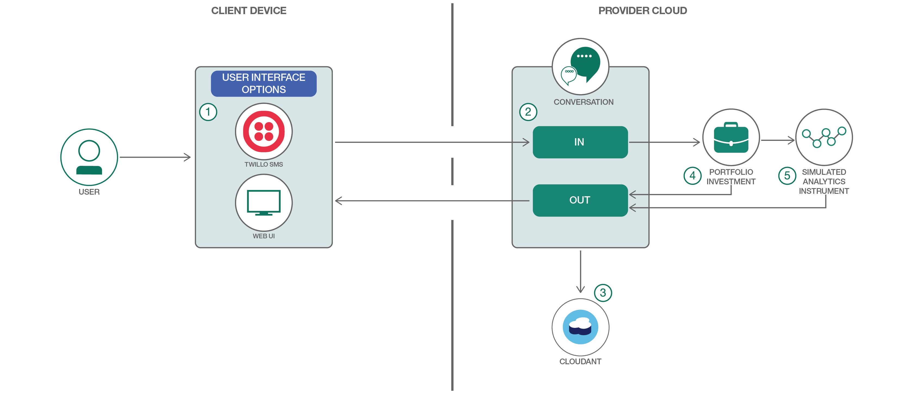
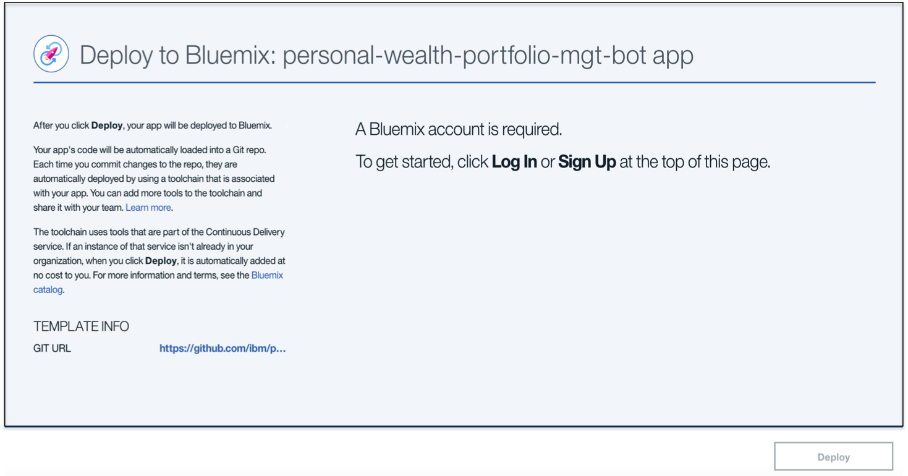
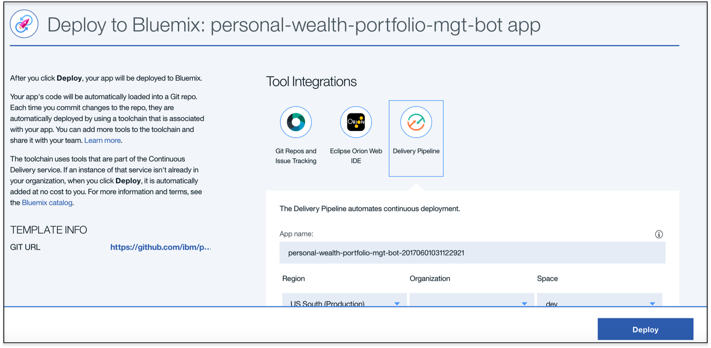
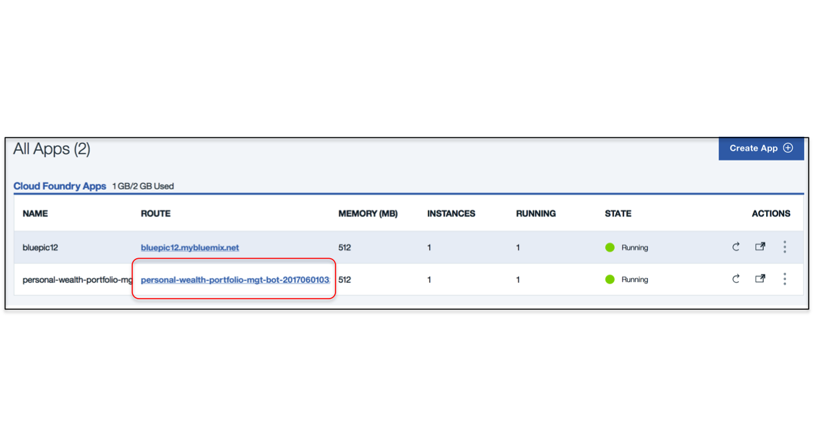
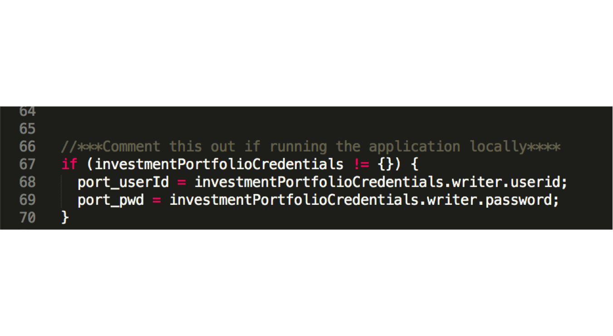

# 个人财富组合管理机器人

[](https://travis-ci.org/IBM/personal-wealth-portfolio-mgt-bot)

*阅读本文的其他语言版本：[한국어](README-ko.md)。*

在本 developer journey 中，将创建一个基于 Watson Conversation 的财务方面的聊天机器人，
该机器人允许用户执行以下操作：1) 使用 Investment Portfolio 服务查询其投资组合和相关财产 2) 使用 Simulated Instrument Analytics 服务在给定场景下对证券进行计算分析。3) 理解如何在备选接口之间进行切换：a) Web 接口 b) TwilioSMS

完成此次学习之旅后，读者将掌握如何：

* 使用 Watson Conversation 创建聊天机器人对话
* 设置与 Watson Conversation 机器人交互的多个接口：Web 和 Twilio
* 访问 Investment Portfolio 服务，挑选种子数据并将它们发送给该服务
* 将数据和一个场景发送到 Simulated Instrument Analytics 服务，以检索分析结果

<p align="center">
  
</p>

## 包含的组件
- Bluemix Watson Conversation
- Bluemix Cloudant NoSQL DB
- Bluemix Investment Portfolio
- Bluemix Simulated Instrument Analytics
- TwilioSMS

## 步骤

使用 ``Deploy to Bluemix`` 按钮**或**创建这些服务并运行 ``Run Locally``。

使用 IBM Cloud for Financial Services，借助 Watson 和开发人员 starter 工具包创建金融服务的未来。访问 https://developer.ibm.com/finance/


## 部署到 Bluemix

[](https://bluemix.net/devops/setup/deploy?repository=https://github.com/IBM/personal-wealth-portfolio-mgt-bot)

1.在部署之前，请登录到您的 Bluemix 帐户。如果已登录，请忽略此步骤。


2.我们可以看到，该应用程序已准备好部署，在按下 Deploy 之前，需要确保应用程序名称、地区、组织、空间都是有效的。


3.在 Toolchain 中，已部署了该应用程序。如果需要，也可以选择通过 Eclipse IDE、git changes 来编辑代码。


4.完成 **Deploy Stage** 后，您会看到两个阶段已成功通过


5.要查看为此次学习之旅创建和配置的应用程序和服务，可以使用 Bluemix 仪表板。该应用程序名为 personal-wealth-portfolio-mgt-bot，带有一个唯一后缀：

 * [**Watson Conversation**](https://console.ng.bluemix.net/catalog/services/conversation)
 * [**Cloudant NoSQL DB**](https://console.ng.bluemix.net/catalog/services/cloudant-nosql-db/)
 * [**Investment Portfolio**](https://console.ng.bluemix.net/catalog/services/investment-portfolio)
 * [**Simulated Instrument Analytics**](https://console.ng.bluemix.net/catalog/services/simulated-instrument-analytics)

**备注** 在运行该应用程序之前，还需要完成其他一些步骤。

开始配置过程之前，本地克隆 `personal-wealth-portfoli-mgt-bot` 代码。在终端窗口中，运行：

  `$ git clone https://github.com/IBM/personal-wealth-portfolio-mgt-bot.git`

## A. 配置 Watson Conversation

必须对 Conversation 服务进行训练，才能成功使用这个应用程序。训练数据在下面的文件中提供：[`resources/workspace.json`](resources/workspace.json)

  1.确保您已登录到 Bluemix

  2.导航到左上侧，单击 3 条平行线，并从左侧导航面板中选择 Dashboard。

  3.向下滚动，并在 All Services 下选择您要使用的 Conversation 服务的实例

  4.到达 Service details 页面后，向下滚动（如有必要）并单击页面右侧的绿色 Launch tool 按钮。这将启动 Conversation 服务的工具，使您能够构建对话流并训练您的聊天机器人。这会带您跳转到 Conversation 服务中您的工作区，该工作区代表一组唯一的聊天流和训练示例。这允许您在单个 Conversation 服务内有多个聊天机器人。

  5.到达该页面后，您会看到“创建”新工作区或“导入”现有工作区的选项。在本例中，我们将“导入”一个已创建的聊天机器人，所以选择“导入”（单击 Create 按钮旁边的箭头）。

  <p align="center">
    
  </p>

  6.单击 Choose a file，导航到此项目存储库的克隆版本的 resources 目录，并选择文件 workspace.json。选择该文件后，确保选择了 Everything (Intents, Entities, and Dialog) 选项。

  7.单击 Import 上传该 .json 文件，以创建一个工作区并训练 Conversation 服务使用的模型。

**<span style="color:red">备注：**</span>记下您的工作区 ID，[第 C 步](#c-configuring-your-environment-variables-in-bluemix) 中将会使用它。

要在训练完成后找到您的工作区 ID，请单击 Workspace 窗格右上角的 3 个垂直排列的点，并选择 View details。完成上传后，您会看到一个新的工作区。为了将此工作区连接到我们的应用程序，需要将工作区 ID 包含在应用程序仪表板上的环境变量中（如果使用了 ``deploy to Bluemix`` 按钮）或保存在文件 .env 中（如果将在``本地``部署）。保存此 ID。

*或者*，如果您想了解对话，也可以选择该工作区并选择 **Dialog** 选项卡，这里给出了该对话的一个片段：

<p align="center">
  
</p>


## B. 向 Investment Portfolio 服务发送种子信息

现在需要手动向 Investment Portfolio 发送种子信息。在所有这些步骤中，将 **userid, password** 替换为来自您的 Bluemix 服务的凭证。

i. 在 Portfolio Investment 服务中手动创建投资组合条目的示例：

**备注**
* {service-user-id} 是与您的 Portfolio Investment 服务相关的用户 ID
* {service-user_password} 是与您的 Portfolio Investment 服务相关的密码

`curl -X POST -u "{service-user-id}":"{service-user_password}" --header 'Content-Type: application/json' --header 'Accept: application/json' -d '{ "name":"P1", "timestamp": "2017-02-24T19:53:56.830Z", "closed": false, "data": { "manager": "Edward Lam" }}' 'https://investment-portfolio.mybluemix.net/api/v1/portfolios'`

ii.在条目中手动创建财产的示例：

`curl -X POST -u "{service-user-id}":"{service-user_password}" --header 'Content-Type: application/json' --header 'Accept:application/json' -d '{ "timestamp": "2017-05-05T19:53:56.830Z", "holdings": [ { "asset": "IBM", "quantity": 1500, "instrumentId": "CX_US4592001014_NYQ"}, { "asset": "GE", "quantity": 5000, "instrumentId": "CX_US3696041033_NYQ" }, { "asset": "F", "quantity": 5000, "instrumentId": "CX_US3453708600_NYQ" }, { "asset": "BAC", "quantity": 1800, "instrumentId": "CX_US0605051046_NYS" } ] }' 'https://investment-portfolio.mybluemix.net/api/v1/portfolios/P1/holdings'`


## C. 在 Bluemix 中配置环境变量
实际运行该应用程序之前，需要在 Bluemix 中手动更新 3 个环境变量：

转到应用程序的 `runttime` 选项卡。滚动到屏幕底部，`添加`以下环境变量：

**<span style="color:red">备注：</span>**将工作区 ID 的`值`替换为您在[第 A 步](#a-configure-watson-conversation) 中记录的值。


| Name                                                  | Value                                |
|-------------------------------------------------------|--------------------------------------|
| WORKSPACE_ID                                          | 5b4d1d87-a712-4b24-be39-e7090421b014 |
| USE_WEBUI                                             | true                                 |
| CRED_SIMULATED_INSTRUMENT_ANALYTICS_SCENARIO_FILENAME | ./resources/spdown5_scenario.csv     |

单击 **Save** 重新部署您的应用程序。

## D. 从 Bluemix 运行应用程序
现在您已准备好从 Bluemix 运行您的应用程序。选择 URL


**备注：**如果获得 *not Authorized* 消息，则需要确认所使用的凭证与 Bluemix 中的凭证相匹配。

# 在本地运行应用程序
> 备注：只有在本地运行而不是使用 ``Deploy to Bluemix`` 按钮时，才需要这些步骤

1.[克隆存储库](#1-clone-the-repo)
2.[创建 Bluemix 服务](#2-create-bluemix-services)
3.[配置 Watson Conversation](#3-configure-watson-conversation)
4.[向 Investment Portfolio 发送种子信息](#4-seed-investment-portfolio)
5.[配置清单文件](#5-configure-manifest)
6.[配置 .env 文件](#6-configure-env-file)
7.[更新 ``controller.js`` 文件](#7-update-file)
8.[运行应用程序](#8-run-application)


## 1.克隆存储库

本地克隆 `personal-wealth-portfoli-mgt-bot 代码`。在终端中，运行：

  `$ git clone https://github.com/IBM/personal-wealth-portfolio-mgt-bot.git`

## 2.创建 Bluemix 服务

创建以下服务：

* [**Watson Conversation**](https://console.ng.bluemix.net/catalog/services/conversation)
* [**Cloudant NoSQL DB**](https://console.ng.bluemix.net/catalog/services/cloudant-nosql-db/)
* [**Investment Portfolio**](https://console.ng.bluemix.net/catalog/services/investment-portfolio)
* [**Simulated Instrument Analytics**](https://console.ng.bluemix.net/catalog/services/simulated-instrument-analytics)

**备注**
* 因为此次学习之旅使用了 4 个 Bluemix 服务，您可能达到了已实例化服务数量的限制。要解决此问题，可以删除不再需要的服务。此外，如果达到已创建应用程序数量的限制，可能还需要删除所有不再需要的应用程序。
* 记录 Conversation 服务的 credentials 选项卡上的用户 ID 和密码。

## 3.配置 Watson Conversation
> 备注：执行 ``Deploy to Bluemix`` 部分的 A 部分

## 4.向 Investment Portfolio 发送种子信息
> 备注：执行 ``Deploy to Bluemix`` 部分的 B 部分

## 5.配置清单文件
编辑包含您的代码的文件夹中的 `manifest.yml` 文件，将 `portoflio-chat-newbot` 替换为您的应用程序的唯一名称。您指定的名称决定了应用程序的 URL，比如 `your-application-name.mybluemix.net`。此外，更新服务标签和服务名称，使它们与 Bluemix 中的信息相匹配。`manifest.yml` 文件的相关部分类似于：

    ```yml
    declared-services:
    conversation:
       label: Conversation
       plan: free
    Cloudant-service:
       label: cloudantNoSQLDB
       plan: Lite
    investment-portfolio-service:
       label: fss-portfolio-service
    instrument-analytics:
       label: fss-scenario-analytics-service
    applications:
        - services:
        - Conversation
        - Cloudant-service
        - investment-portfolio-service
        - instrument-analytics-service
    name: portfolio-chat-newbot
    command: npm start
    path: .
    memory: 512M
    instances: 1
    domain: mybluemix.net
    disk_quota: 1024M
    ```

## 6.配置 .env 文件

1.使用以下命令复制样本 `.env.example` 文件，在您的项目存储库的克隆版本的根目录中创建一个 `.env` 文件：

**备注**大部分文件系统都将前面带 "." 的文件视为隐藏文件。如果您位于 Windows 系统上，应该能使用 [GitBash](https://git-for-windows.github.io/) 或 [Xcopy](https://www.microsoft.com/resources/documentation/windows/xp/all/proddocs/en-us/xcopy.mspx?mfr=true)


  ```none
  cp .env.example .env
  ```

  需要使用[第 2 步](#2-create-bluemix-services) 中创建的每个服务的 Bluemix 凭证来更新凭证。

    `.env` 文件看起来将类似于：

    ```none

    USE_WEBUI=true

    #CONVERSATION
    CONVERSATION_URL=https://gateway.watsonplatform.net/conversation/api
    CONVERSATION_USERNAME=
    CONVERSATION_PASSWORD=
    WORKSPACE_ID=

    #CLOUDANT
    CLOUDANT_URL=

    #INVESTMENT PORTFOLIO
    CRED_PORTFOLIO_USERID=
    CRED_PORTFOLIO_PWD=
    URL_GET_PORTFOLIO_HOLDINGS=https://investment-portfolio.mybluemix.net/api/v1/portfolios

    CRED_SIMULATED_INSTRUMENT_ANALYTICS_URL=https://fss-analytics.mybluemix.net/api/v1/scenario/instrument
    CRED_SIMULATED_INSTRUMENT_ANALYTICS_ACCESSTOKEN=
    CRED_SIMULATED_INSTRUMENT_ANALYTICS_SCENARIO_FILENAME=

    #TWILIO
    USE_TWILIO=false
    USE_TWILIO_SMS=false
    TWILIO_ACCOUNT_SID=
    TWILIO_AUTH_TOKEN=
    TWILIO_API_KEY=
    TWILIO_API_SECRET=
    TWILIO_IPM_SERVICE_SID=
    TWILIO_NUMBER=
    ```

## 7.更新文件

一个额外的步骤是，注释掉 Controller 文件中设置 Investment Portfolio 服务的用户 ID 和密码的几行（第 66-70 行）


## 8.运行应用程序

a. 安装应用程序所需的依赖项：

```none
npm install
```

b. 在本地启动该应用程序：

```none
npm start
```

c. 转到以下地址来测试您的应用程序：[http://localhost:3000/](http://localhost:3000/)


    启动一个与您的机器人的对话：
<p align="center">
      
</p>


## 配置 Twilio（如果希望将您的应用程序连接到 Twilio，可以选择这么做）

如果计划使用 Twilio 作为接口，仍需要执行一个额外的步骤。我们必须更新另外几个环境变量。这同样是一个可选步骤。默认情况下，该应用程序连接到一个 Web 用户界面；但这一步使您能连接到 Twilio。

**备注：**使用 Twilio 只是一种选择，该应用程序默认情况下会使用 Web 用户界面。所以，应该仅在使用 Twilio 时配置 Twilio。

1.如果尚未这么做，可通过 Twilio 服务获取一个电话号码。https://www.twilio.com/
2.编辑 .env 文件来添加 Twilio 的凭证。可以在获取 Twilio 电话号码时从仪表板获取此信息。

<p align="center">
  
</p>

  * 将 USE_TWILIO_SMS 变量设置为 *true*。
  * 设置 TWILIO_ACCOUNT_SID 变量
  * 设置 TWILIO_AUTH_TOKEN 变量
  * 设置 TWILIO_NUMBER 变量

如果单击了 deploy to Bluemix 按钮，则保存新值并在 Bluemix 中重新启动该应用程序，观察日志中是否有错误。

为了让 Twilio 监听本地端口 (:3000)，需要设置一个连接 Webhook 的通道。可以使用工具 *ngrok* https://ngrok.com/。继续并下载 ngrok。打开一个终端窗口，使用以下命令启动 ngrok：

```none
ngrok http 3000
```

**备注：**如果从 Bluemix 运行该应用程序，请使用端口 80。

您将获得类似下面这样的响应：

<p align="center">
  
</p>

复制 https uri 并将它粘贴到（Twilio 仪表板中）您的 SMS Webhook 的 entry 字段中：

<p align="center">
  
</p>


# 调整/扩展该学习之旅

可添加其他金融服务来增强当前应用程序。Xignite, Inc. (http://xignite.com) 提供了基于云的金融市场数据 API，它们可与 Bluemix Fintech 服务并列运行。具体来讲，GetGlobalDelayedQuotes() Rest API 可以提供特定全球证券的延迟报价。

<p align="center">
  
</p>

# 故障排除

    * 要排除 Bluemix 应用程序的故障，请使用日志。要查看日志，请运行以下代码：

    ```bash
    cf logs <application-name> --recent
    ```

    * 如果您在本地运行，请仔细检查您的环境变量，以确认它们是匹配的。

    Bluemix 服务（Conversation、Cloudant 和 Discovery）的凭证可以在 
    Bluemix 中的 ``Services`` 菜单中找到，然后选择 ``Service Credentials`` 
    选项。


    * 也可以访问 `https://<您的应用程序的名称>.mybluemix.net/debug.html` 来调试应用程序，您会看到一个显示了元数据的面板，上面包含与所使用的服务交互的细节。

# 许可

[Apache 2.0](LICENSE)

# 隐私声明

这个 Node Web 应用程序样本包含跟踪部署到 Bluemix 和其他 Cloud Foundry 平台的部署过程的代码。每次部署时，都会将以下信息发送到 Deployment Tracker 服务：

* 应用程序名称 (`application_name`)
* 空间 ID (`space_id`)
* 应用程序版本 (`application_version`)
* 应用程序 URI (`application_uris`)

此数据收集自 IBM Bluemix 和其他 Cloud Foundry 平台中的 `VCAP_APPLICATION` 环境变量。IBM 使用此数据跟踪与将样本应用程序部署到 IBM Bluemix 相关的指标。仅有那些包含代码以对 Deployment Tracker 服务执行 ping 操作的样本应用程序的部署过程才会被跟踪。

### 禁用部署跟踪

通过从此存储库根目录中的 `server.js` 文件开头部分删除 `require('cf-deployment-tracker-client').track();`，可以禁用部署跟踪。
